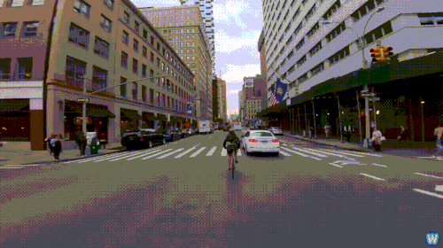

# Ön-Çalışma-6
## Mask R-CNN ile Bölütleme (Segmentasyon)     

Bu çalışmada, COCO veri setinde eğitilmiş 80 farklı nesne tanıyan Mask R-CNN modeli kullanıldı. 

Önceki çalışmalardan farklı olarak Mask R-CNN, segmentasyon sayesinde, nesneye ait olan pikselleri de tespit etmektedir. 

- Orijinal Video Örneği

  

- Mask R-CNN Çıktısı

  

- Segmentasyon daha yüksek işlem gücü gerektirdiğinden, saniye başına işlenen çerçeve sayısında düşüş gözlemlenmekte.  
>MASK_RCNN  
>Elapsed time: 932.510 secs  
>Average FPS : 0.09  
